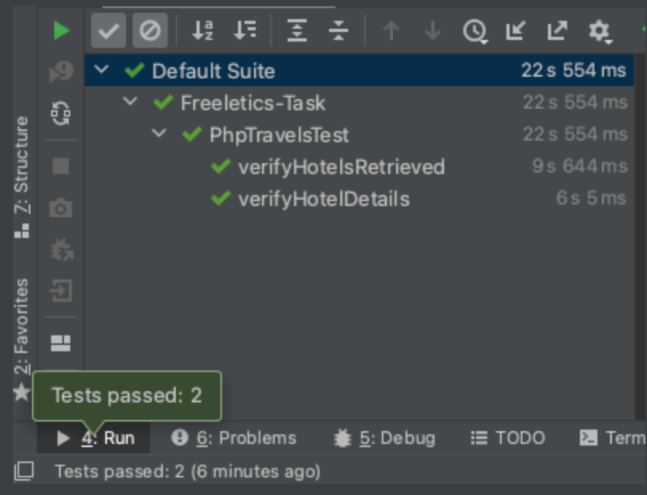
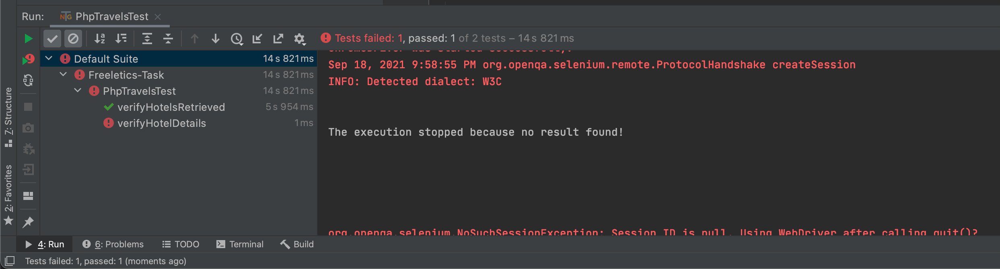

# Freeletics Task
In this task you will find the mentioned test scenarios in web using Chrome Driver.

### Requirements:
- Java 8
- Lombok plugin.
- TestNG

To enable Lombok plugin you need to install it using the Preference --> Plugins --> Search on "Lombok" & enable it.

### Main Test Scenario:
- [x] 1- Open the website https://www.phptravels.net in a web browser.

- [x] 2- Search for hotels in “Munich”.

- [x] 3- The search results page contains at least 3 results.

- [x] 4- The first result item displays the price.

- [x] 5- The first result item displays an image.

- [x] 6- There is a section with title “Star Grade”, which includes 5 items available for
         selection.
    
- [x] 7- Clicking on “Details” button directs to the offer’s detail page
         
### To Run the test cases using the below command line:
`mvn test`    

### Results:
- Passed results:

---

- No result found result:

